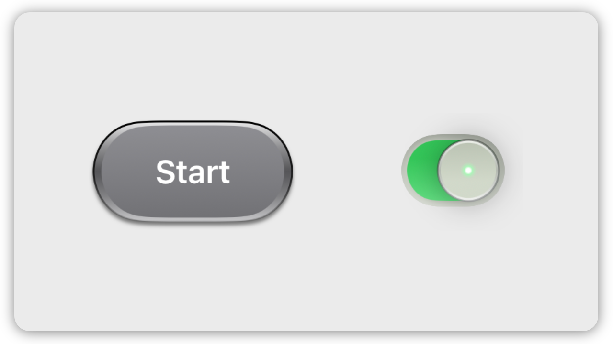

# mainframeUI



A sleek button and toggle style for SwiftUI. Inspired by designs shared by Jordan Singer (@jsngr) for Mainframe.

# Usage
```swift
import mainframeUI

Button("Start") { }
    .toggleStyle(.mainframe)
    .tint(.gray)

Toggle("Setting", isOn: $isOn)
    .toggleStyle(.mainframe)
```

# Disclaimer

This package is not affiliated with or endorsed by Mainframe or its team. It's an independent project created for educational purposes and to showcase SwiftUI skills.
